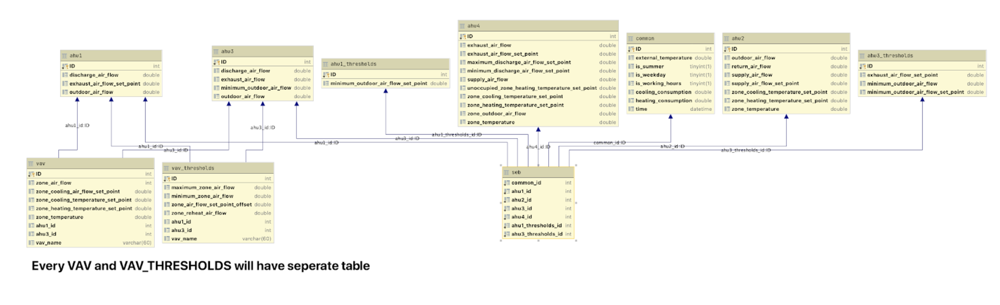

# mysql-files

## MySQL DB
### Normalized Schema
#### Summary:
The schema is designed to normalize the CSV data into one that fits a relational database structure. The units and devices are broken down into different tables with each entry having an ID that refers to corresponding tables. This allows for a more meaningful reading and data querying.
#### Schema:  

The schema is broken down into multiple tables. 
- **SEB**: Contains the unique id for each entry of data for each AHU and common table. These ids is the master labels and will be referenced by other tables.   
- **Common**: Holds data points that are unique to each time entry and do not belong to any specific AHU or VAVs. The points contained in this table are external.  temperature, is_summer, is_weekday, is_working_hours, cooling_consumption, heating_consumption, and timestamp. Has a foreign key that references the SEB table. 
- **AHU and  AHU_threshold**: Separate tables for each AHU. As not all devices have the same metric, each table will have a different structure with columns storing the metrics unique to the said AHU. AHU ID is both the primary key and foriegn key, which references the SEB table.  
- **VAV and VAV_threshold**: Separate table for each VAV device. All VAV devices have the same table structure since they are measuring the same metrics. There will also be two additional columns where each entry references the ID of the respective AHU table in which the VAV belongs to. For example, VAV102 table will have an ID referencing AHU1 and a null value for AHU3, while VAV 105 would reference AHU3 and have a null value for AHU1.  
#### Relationship With Other Services:
The normalized table is primarily used in the hunting service. As each VAV has its own separate table, it is easier on the service to query each table and perform the hunting analysis on the data.  

### Denormalized Table
#### Summary:
*Table name: seb_processed_data_time_shifted*\
The denormalized table is one table where each row represents all data points for a particular time stamp. The format is the exact same as the processed CSV. As the provided data from the website has historic data, the time stamp has also been shifted to simulate “live” data inflow for the duration of this project. 
#### Schema:
The table structure is the same as the CSV file of the processed data. Each column of the table corresponds to the same column in the CSV file. The primary key for the table is the IDs. The IDs for each row of data are assigned through auto incrementation. The datetime column has an additional layer of indexing, through MySQL MUL key attribute. This allows for faster querying.
#### Relationship With Other Services:
The denormalized Table is used in the labeling of data and the building the machine learning model. The data queried from the table is used by the Airflow Data Pipeline to run daily predictions to be displayed in the react application.

### Labeled_Agg Tables
#### Summary:
*Table names: zoneairflow_labeled_agg,  zonetemp_labeled_agg*\
The labeled_agg tables are tables that store the labeled data at the end of the machine learning process. All tables will store the label and occurrences for each day. The table name will contain the metric that a particular table is storing data for (currently only zone airflow and zone temperature). 
#### Schema:
All labeled_agg tables have the same structure, having only three columns - date, label, and occurrence. The date and label combination will serve as the primary key. The occurrence column stores the number of times a specific label occurred each day. 
#### Relationship With Other Services:
These tables store the aggregated end result of the machine learning model process. After the machine learning process is finished labelling, the data gets aggregated and inserted in the respective labeled_agg tables via a script. This data will then be queried by the front end, via an API, to display to the user.

### Additional Notes:
All structure and data used in our development are provided in MySQL dump files. Files can be found at the following link.  
[MySQL dump](https://drive.google.com/drive/folders/1e_78x72e4su9_SzRKDIC_h6mcZRT8K-C)

